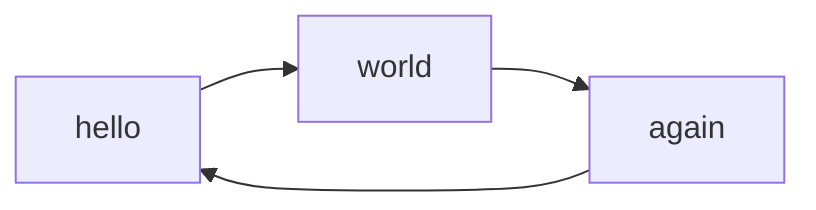

PyMdown Extensionsの`pymdownx.superfences`を[公式ドキュメントの記載](https://facelessuser.github.io/pymdown-extensions/extras/mermaid/?h=mermaid#using-in-mkdocs)通りに設定してmermaidを書いたら、`mkdocs serve`では正常に動作するものの、`mkdocs build`では動作しませんでした。

そのときに解決した方法を記載します。

<!-- more -->

## 結論

[Mkdocs-Mermaid2](https://mkdocs-mermaid2.readthedocs.io/en/master/)プラグインを使いましょう。

### インストール

```shell
pip install mkdocs-mermaid2-plugin
```

### 設定方法

=== "方法1"

    プラグインに記載する。

    ```yaml title="mkdocs.yml"
    plugins:
        - mermaid2
    ```

=== "方法2"

    superfencesに適用させる。

    ```yaml title="mkdocs.yml"
    markdown_extensions:
        ...
        - pymdownx.superfences:
            custom_fences:
                - name: mermaid
                  class: mermaid
                  format: !!python/name:mermaid2.fence_mermaid
    ```

## 状況説明

`mkdocs.yml`には以下のように定義していました。  

```yaml title="mkdocs.yml"
markdown_extensions:
  - pymdownx.superfences:
      custom_fences:
        - name: mermaid
          class: mermaid
          format: !!python/name:pymdownx.superfences.fence_code_format

extra_javascript:
  - https://unpkg.com/mermaid@10.6.1/dist/mermaid.min.js
```

以下のように書き、`mkdocs build`すると、ページを開いたときにmermaidを書いた箇所がシンタックスエラーになります。

````markdown

````


原因調査はしていません。

[Mkdocs-Mermaid2](https://mkdocs-mermaid2.readthedocs.io/en/master/)プラグインを使うと回避できるので、解消だけしたい方は[結論](#_1)に記載した方法をお試しください。
