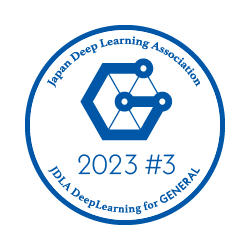

# :simple-rescuetime: Resume

## Summary

- 要件定義から運用保守に至るまでシステム開発ライフサイクル全般に精通した経験豊富なシステムエンジニアです。
- 新しい技術を常に学び、革新的で拡張性のあるソリューションを提供するよう努力しています。

## Experiences

- 顧客との要件調整を通じ、ビジネスニーズを捉えた上で、システム設計から実装までをリードしてきた実績があります。
- 開発チームをまとめ、プロジェクトの進捗管理を行いながら、納期とコストの両立を実現してきました。
- ステークホルダーとのコミュニケーションを重視しながらプロジェクトを遂行してきた経験があります。

## Skills

- :fontawesome-brands-python: __Python__

    ---

    - 2022年から一番使っている言語
    - AWS Lambdaを用いたWebAPIの開発経験あり
    - 主にv3.8で開発し、他のバージョンは経験なし

- :fontawesome-brands-php: __PHP__

    ---

    - 一番使っていた時期は、2018年から2021年
    - CodeIgniterを用いたWebアプリケーションの開発経験あり
    - 主にv7.3で開発し、v8.0以降は経験なし

- :fontawesome-brands-java: __Java__

    ---

    - 一番最初に覚えた言語
    - 実務ではJava 7のみ経験あり

- :fontawesome-brands-js: __JavaScript__

    ---

    - フロントエンド開発のため経験
    - Webアプリケーション開発が多いため、利用頻度は高い
    - jQueryを利用した開発経験あり

- :fontawesome-brands-html5: __HTML__

    ---

    - フロントエンド開発のため経験
    - Webアプリケーション開発が多いため、利用頻度は高い

- :fontawesome-brands-css3: __CSS__

    ---

    - フロントエンド開発のため経験
    - 基本的な読み書きはできる

- :fontawesome-brands-react: __React.js(Next.js)__

    ---

    - フロントエンド開発のため1年ほど経験
    - 一人でアプリケーションを開発することができる

- :simple-quicklook: __SQL__

    ---

    - 関わってきたさまざまな案件で経験
    - 基本的な読み書きはできる
    - 実行計画を意識したSELECT文が書ける

- :fontawesome-brands-aws: __AWS__

    ---

    - 実務で利用しているクラウドサービス
    - 簡単なサービス設計はできる
    - デザインパターンを見て理解できる

## Certifications

<ul style="display:grid; grid-template-columns: repeat(auto-fill, minmax(200px, 1fr)); gap: clamp(8px,1.5svw,16px); list-style: none;" markdown="span">

<li markdown="span">
<figure markdown="span">
  
  <figcaption>JDLA Deep Learning for GENERAL</figcaption>
</figure>
</li>

<li markdown="span">
<figure markdown="span">
  
  <figcaption>AWS Certified Solutions Architect – Associate</figcaption>
</figure>
</li>

<li markdown="span">
<figure markdown="span">
  
  <figcaption>AWS Certified Cloud Practitioner</figcaption>
</figure>
</li>

<li markdown="span">
<figure markdown="span">
  
  <figcaption>ORACLE MASTER Bronze Oracle Database 12c</figcaption>
</figure>
</li>

<li markdown="span">
<figure markdown="span">
  
  <figcaption>LPIC-1</figcaption>
</figure>
</li>

<li markdown="span">
<figure markdown="span">
  
  <figcaption>応用情報技術者試験</figcaption>
</figure>
</li>

<li markdown="span">
<figure markdown="span">
  
  <figcaption>Oracle Certified Java Programmer, Gold SE 8</figcaption>
</figure>
</li>

</ul>
