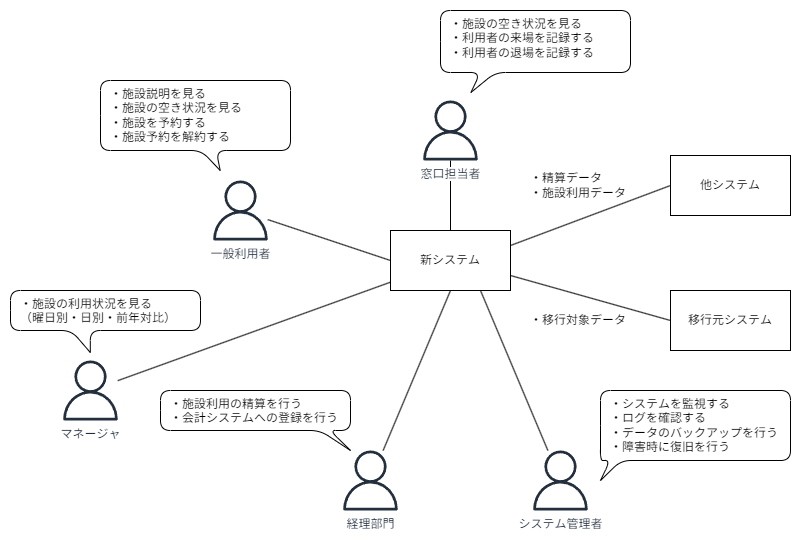
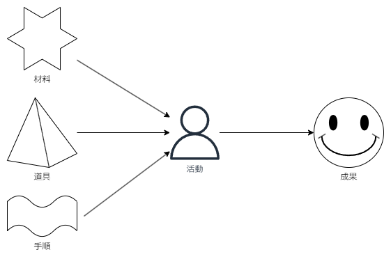
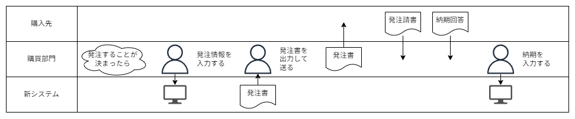
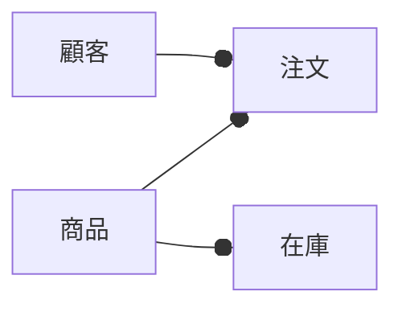

要件定義の準備として下記の材料を揃える。

- 企画書
- 全体像
- 利用する実装技術
- 実現したいこと一覧（要求一覧）
- 行動シナリオ
- 概念データモデル

## 企画を確認する

ゴールを確認するために必要である。企画が確認できない = ゴールの定義が不明瞭という状態である。

そのために、関係各位がひと目で理解を共有できる企画書を作成するとよい。

### まとめておくべき項目

1. プロジェクトの名称
2. なぜ
    - 目的
3. 何を
    - 目的達成のために作るもの
    - 作るものの説明
    - 作るものを利用する人
    - 利用する人が得られる便益
4. どのように
    - 作るための体制
    - 期限

## 全体像を描く

「何を」の部分をビジュアルに表現したものを『全体像』である。

書き方

- システムを中心に置く
- 利用者を配置する
- 利用者が行うことを書く
- 連携システムを配置する
- 連携データを書く

## 実装技術を決める

実装の都合がわからないとソフトウェアの要件が決められないため、要件定義の前段階で最低限のアーキテクチャを決める。

e.g.

- クライアントが利用する端末（Webブラウザ / モバイルなど）
- サーバ構成
- ユーザーアクションの検知方法（マウス / タッチなど）
- データと画面上の項目の連携方法
- プログラミング言語
- 通信プロトコル
- フレームワーク
- データベースの種類

## 実現したいことを整理整頓する

やりたいことを一覧化して整理する。

今回のスコープからかけ離れているものや、要求同士の間で矛盾やコンフリクトを起こしているものなどについては、分析・整理を行って、本当に実現すべきは何かを検討する。

## 利用者の行動シナリオを書く

利用者の行動に応えられる要件を定義するために必要である。  
本来は要件定義で実施する工程ではない。業務要件の定義あるいは業務設計と呼ばれる工程であり、ソフトウェアの要件定義とは別物である。

### 仕事の構造

利用者が行う行動の単位を「仕事」とする。

e.g.

- ほしい商品を注文する
- 受注した商品を出荷手配する
- 受けた電話の伝言をメモする
- 目玉焼きを作る

つまり、

**何らかの成果と**  
**その成果を出すために行う活動**  
**のまとまり**

と考える。

`何かをする（活動）→ 何かをした結果（成果）`  
これがワンセットで1つの"仕事"

活動するためには、「材料」「道具」「手順」の要素がそろったとき活動可能になる。これらは活動を通して成果に変換される。  

成果の変換には、「状態の変更」も含まれる。たとえば、「検査をする」活動。検査前後で材料は何も変わらないが、状態が異なる。

"仕事"をするには、誰かが"仕事"をリクエストする必要がある。大きく2つある。

- 他からのリクエストがあったとき
- ある条件を満たしたことを検知したとき

これらのリクエストがあったとき、"仕事"が実行される。

上記を意識したうえで行動シナリオを作成する。

## 概念データモデルを作る

「どのようなデータを保持するのか」が気になってしまいがち。要件定義の補助線となるように、メモ書きくらいの意味合いで作る。

大きなエンティティ単位で表現できれば問題ない。

